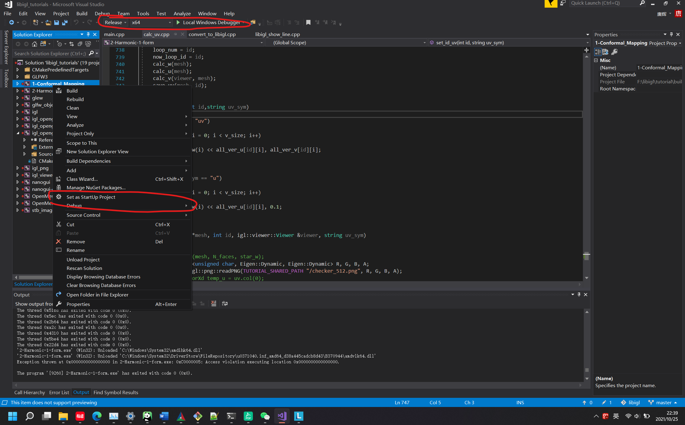
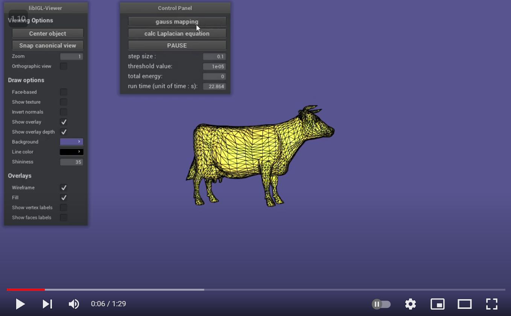
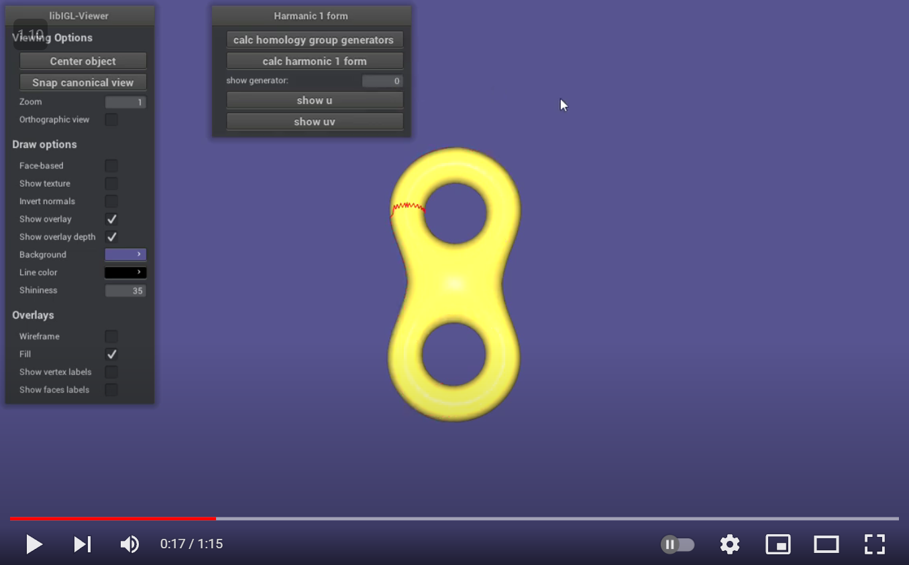

## Get started with:

### Downloading repository
```bash
git clone --recursive https://github.com/tanghui-cslt/Computational-Geometry.git
```

* Windows

The core libigl functionality only depends on the C++ Standard Library and
Eigen.

To build all the examples in the tutorial, you can use the CMakeLists.txt in the tutorial folder:


```bash
cd tutorial
mkdir build
cd build
cmake -DCMAKE_BUILD_TYPE=Release -G "Visual Studio 15 2017 Win64" ../
```

It works on Visual Studio 2017

Notice: libigl only supports the Microsoft Visual Studio 2015 compiler and higher version, in 64bit mode. It will not work with a 32bit build and  older versions of visual studio.


* Linux

Many linux distributions do not include gcc and the basic development tools in their default installation. On Ubuntu, you need to install the following packages:

```bash
sudo apt-get install git
sudo apt-get install build-essential
sudo apt-get install cmake
sudo apt-get install libx11-dev
sudo apt-get install mesa-common-dev libgl1-mesa-dev libglu1-mesa-dev
sudo apt-get install libxrandr-dev
sudo apt-get install libxi-dev
sudo apt-get install libxmu-dev
sudo apt-get install libblas-dev
```

,then 

```bash
cd tutorial
mkdir build
cd build
cmake -DCMAKE_BUILD_TYPE=Release  ../
make -j8
```

Notice: I just compiled it on WSL2 (Windows Subsystem for Linux) successfully,  I think it will work on linux as well.

## Example

### 1-Conformal Mapping.

* Windows

You should set 1-Conformal_Mapping as Startup project firstly, then run it.



* Linux 

In `build` directory, 

```bash
./1-Conformal_Mapping
```

It's a conformal mapping, which maps a closed 2-dim surface to a ball conformally. Below is a vedio.


[](https://www.youtube.com/watch?v=EH7h7xJbSqo)


### 2-Harmonic-1-form.

* Windows

You should set 2-Harmonic-1-form as Startup project firstly,  then run it.


* Linux 

In `build` directory, 

```bash
./2-Harmonic-1-form
```

This is to find a harmonic 1 form on 2-dim surface. Below is a vedio.

[](https://youtu.be/pc_lQX7eLd4)


This repository is based on libigl-1.2 and openmesh-8.0. If you want to learn more about them, please see attach link below:

`https://github.com/libigl/libigl`

`https://www.graphics.rwth-aachen.de/software/openmesh/` 
 
